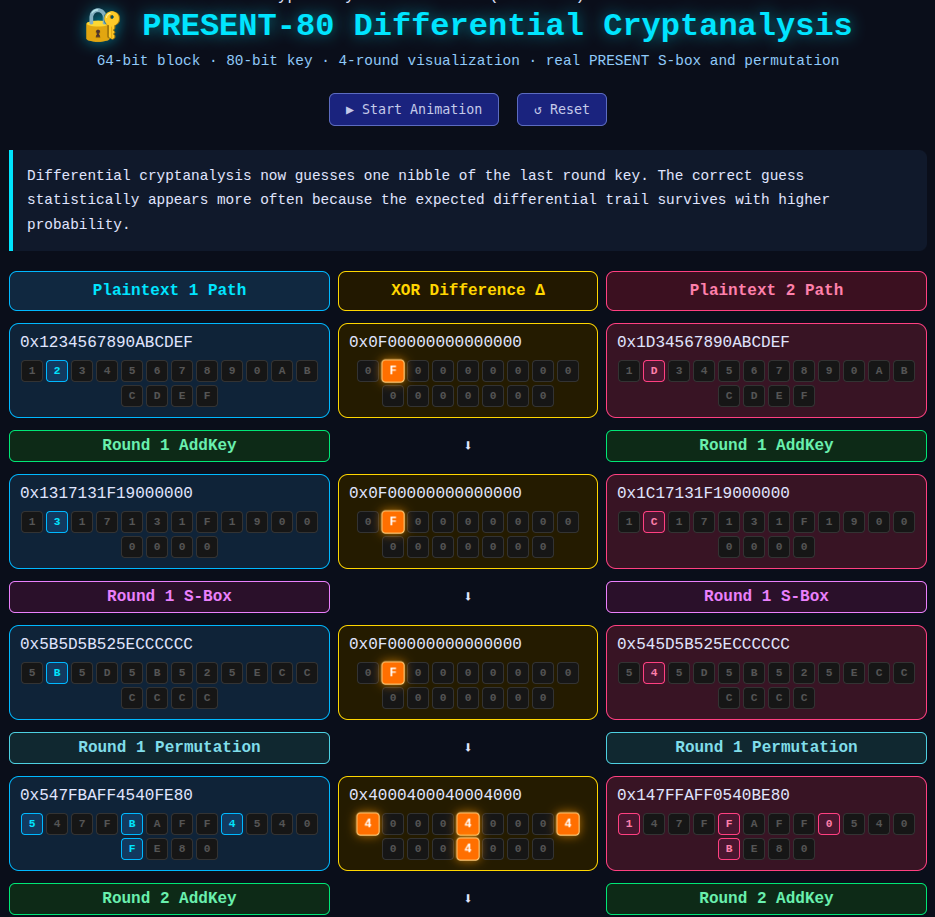
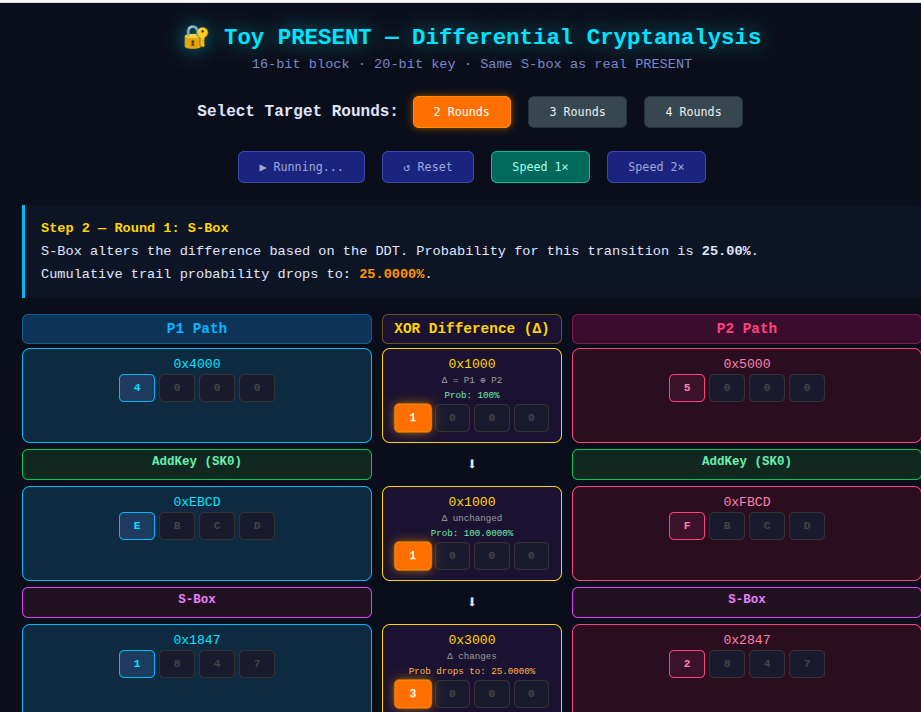

### PRESENT-80 Differential Cryptanalysis Animation

** How To Run 1. 

Save as: present80_animation.html

2. Open in browser: * Chrome  give the path    example (file:///home/pankaj/Documents/pp/present_animation.html)

   
Real PRESENT S-box ✅ Real PRESENT permutation layer ✅ 64-bit state ✅ 80-bit key schedule ✅ BigInt implementation ✅ 4 rounds ✅ Difference propagation visualization ✅ Last-round key nibble attack visualization  

## 
Important Note This is an educational visualization of differential cryptanalysis. The attack scoring section is simplified for demonstration purposes. A real differential attack would: * use real differential trails * compute true probabilities * filter plaintext pairs * partially decrypt ciphertexts using guessed subkeys * statistically rank candidates But visually and structurally, this behaves like a real PRESENT-80 differential attack animation.**

### PRESENT80 CIPHER TRAIL 

  

  ### TOY PRESENT CIPHER TRAIL 

    ✅ 16-bit state ✅ 20-bit key schedule ✅ 2 rounds ✅ 3 rounds✅ 4 rounds ✅ Difference propagation visualization ✅ Last-round key nibble attack visualization  

  

